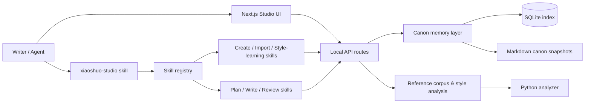
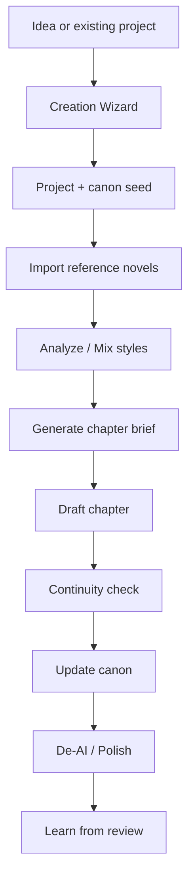

# xiaoshuo

[](https://github.com/Zhao73/xiaoshuo-studio/actions/workflows/ci.yml)
[](./LICENSE)
[](./README.md)
[](./README.en.md)

A local workspace designed for writing long-form novels. It integrates the creation wizard, lore/memory management, reference novel technique analysis, chapter planning, continuity checking, and a skill aggregation hub all in a single project.

`xiaoshuo` primarily addresses the following problems:

- Start from a vague idea and build the novel step-by-step through guided Q&A
- Maintain continuity in long-form serialization not by relying on the model to "just remember", but through a structured `canon` and memory layer
- Import locally saved novel samples to learn pacing, dialogue, hooks, and narrative progression
- Drive the entire project with a single master skill `xiaoshuo-studio`, instead of memorizing a scattered list of skill names
- Export or install skill bundles directly after open-sourcing, allowing others to use it with a single click

## Screenshots

### Homepage


### Creation Wizard


## Core Features

- **In-depth Creation Wizard**: Guided Q&A similar to Plan Mode, automatically generating the project structure, initial `canon`, first volume outline, and Chapter 1 brief
- **Canon & Memory Layer**: Characters, timelines, foreshadowing, plot threads, and world rules can be stored structurally
- **Reference Novel Analysis**: Supports importing local novel folders, chapter splitting, style analysis, and mixed-style cards
- **Continuity Checking**: After writing a chapter, checks for contradictions in character states, locations, and world rules
- **Skill Aggregation Hub**: Remember only `xiaoshuo-studio`, which routes requests to the appropriate sub-skills
- **Open Source Distribution**: Supports `aggregator-only` and `full-bundle` export/install modes

## Architecture Diagram



## Writing Workflow



## Installation Matrix

| Target | Command |
| --- | --- |
| Run locally for development | `npm install && npm run dev` |
| Full local verification | `npm run lint && npm test && npm run build && pytest tests/python -q` |
| Export a master skill for Codex | `npm run skills:export -- --target codex --mode aggregator-only` |
| Export a complete skill bundle for Codex | `npm run skills:export -- --target codex --mode full-bundle` |
| Export a complete skill bundle for Claude Code | `npm run skills:export -- --target claude --mode full-bundle` |
| One-click install master skill for Codex | `npm run skills:install -- --target codex --mode aggregator-only` |
| One-click install complete bundle for Codex | `npm run skills:install -- --target codex --mode full-bundle` |
| One-click install complete bundle for Claude Code | `npm run skills:install -- --target claude --mode full-bundle` |

Default Directories:

- Codex installs to `~/.codex/skills` by default, unless `CODEX_HOME` is set
- Claude Code installs to `~/.claude/skills` by default, unless `CLAUDE_HOME` is set

## Quick Start

```bash
npm install
npm run dev
```

Open `http://localhost:3000` or the local port displayed when Next.js starts.

Recommended initial workflow:

1. Navigate to `/wizard/new-novel`
2. Complete the in-depth creation wizard Q&A
3. Review the auto-generated project, `canon` seed, first volume outline, and Chapter 1 brief
4. Import reference novels if needed
5. Continue writing using the canon-aware workflow

## Master Skill

If you only want to remember one skill name, use:

```text
xiaoshuo-studio
```

It handles requests like:

- "Help me create a cultivation novel step-by-step"
- "Import this local novel folder and analyze its style"
- "Continue writing Chapter 12"
- "Check continuity and update the canon"

For fine-grained control, you can also call sub-skills directly, such as:

- `novel-init-wizard`
- `novel-load-context`
- `novel-plan-next`
- `novel-draft-scene`
- `novel-continuity-review`
- `novel-update-canon`
- `webnovel-import-folder`
- `webnovel-analyze-style`
- `webnovel-write`

## Canon API

Primary local interfaces for long-form memory management:

- `GET /api/canon?projectId=<id>`
- `POST /api/canon/refresh`
- `POST /api/chapters/brief`
- `POST /api/chapters/continuity-check`
- `POST /api/chapters/update-canon`

Creation wizard endpoints:

- `POST /api/wizard/start`
- `POST /api/wizard/answer`
- `GET /api/wizard/session?sessionId=<id>`
- `POST /api/wizard/finish`

## Technique Learning Boundaries

The goal of this project is to **learn techniques, not clone an author's voice**.

Recommended workflow loop:

1. Import or fetch reference materials, retaining source attribution
2. Analyze into reusable metrics and style cards
3. Convert into anti-AI focus constraints and technique prompts
4. Use these constraints for writing or revising drafts
5. Transform review results into practice exercises and learning notes

## Repository Engineering

This repository includes:

- GitHub Actions CI
- Lint / test / build / Python test validation gates
- Issue templates
- PR template
- `CODEOWNERS`
- `CONTRIBUTING.md`
- `SECURITY.md`
- MIT License

## Documentation

- Detailed workflow: [docs/local-codex-studio.md](./docs/local-codex-studio.md)
- Skill map: [docs/skills-map.md](./docs/skills-map.md)
- Chinese tutorial: [docs/tutorial-zh.md](./docs/tutorial-zh.md)
- Style analysis contract: [docs/style-analysis-contract.md](./docs/style-analysis-contract.md)

## Codex Requirements

This project assumes you have already installed and logged into the Codex CLI locally:

```bash
codex --version
```

The web app checks for local Codex availability but does not replace the `codex login` or custom OpenAI API authentication flow.
