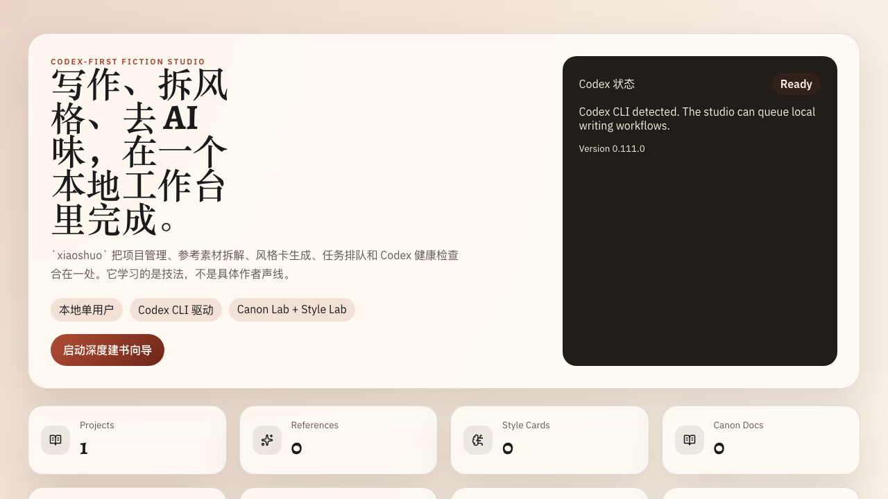
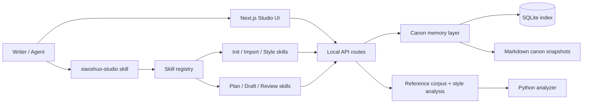
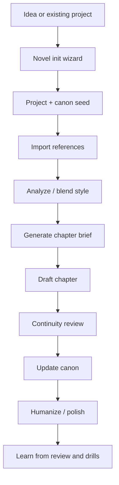

# xiaoshuo

[](https://github.com/Zhao73/xiaoshuo-studio/actions/workflows/ci.yml)
[](./LICENSE)
[](./README.md)
[](./README.en.md)

Local fiction studio for long-form novel planning, canon memory, style learning, and skill-based writing workflows for Codex and Claude Code.

`xiaoshuo` helps you:

- bootstrap a novel through a guided planning wizard
- keep canon memory stable across long serial writing
- import private reference novels for technique transfer
- run the full workflow through one top-level skill: `xiaoshuo-studio`
- export or install skill bundles for Codex and Claude Code

## Screenshots

### Home



### Novel Init Wizard


## Architecture



## Workflow



## Install Matrix

| Goal | Command |
| --- | --- |
| Run locally | `npm install && npm run dev` |
| Seed a playable demo | `npm run demo:seed && npm run dev` |
| Verify locally | `npm run lint && npm test && npm run build && pytest tests/python -q` |
| Export one remembered entry skill for Codex | `npm run skills:export -- --target codex --mode aggregator-only` |
| Export full bundle for Codex | `npm run skills:export -- --target codex --mode full-bundle` |
| Export full bundle for Claude Code | `npm run skills:export -- --target claude --mode full-bundle` |
| Install one remembered entry skill for Codex | `npm run skills:install -- --target codex --mode aggregator-only` |
| Install full bundle for Codex | `npm run skills:install -- --target codex --mode full-bundle` |
| Install full bundle for Claude Code | `npm run skills:install -- --target claude --mode full-bundle` |

Defaults:

- Codex installs to `~/.codex/skills` unless `CODEX_HOME` is set
- Claude installs to `~/.claude/skills` unless `CLAUDE_HOME` is set

## Quick Start

```bash
npm install
npm run dev
```

Open `http://localhost:3000`, or the local port printed by Next.js.

To see the studio with useful first-run content:

```bash
npm run demo:seed
npm run dev
```

The seed command creates one idempotent local demo project, reference sample,
style card, and queued planning job. Running it again will not duplicate the
same demo.

## Top-level Skill

If you only want to remember one skill name, use:

```text
xiaoshuo-studio
```

Typical requests:

- “Help me create a xianxia novel step by step”
- “Import this local novel folder and analyze style”
- “Continue chapter 12”
- “Check continuity and update canon”

## Canon API

- `GET /api/canon?projectId=<id>`
- `POST /api/canon/refresh`
- `POST /api/chapters/brief`
- `POST /api/chapters/continuity-check`
- `POST /api/chapters/update-canon`

Wizard routes:

- `POST /api/wizard/start`
- `POST /api/wizard/answer`
- `GET /api/wizard/session?sessionId=<id>`
- `POST /api/wizard/finish`

## Guardrail

This project is for **technique transfer, not author cloning**.

## Docs

- Local workflow: [docs/local-codex-studio.md](./docs/local-codex-studio.md)
- Skill map: [docs/skills-map.md](./docs/skills-map.md)
- Chinese tutorial: [docs/tutorial-zh.md](./docs/tutorial-zh.md)
- Style analyzer contract: [docs/style-analysis-contract.md](./docs/style-analysis-contract.md)
