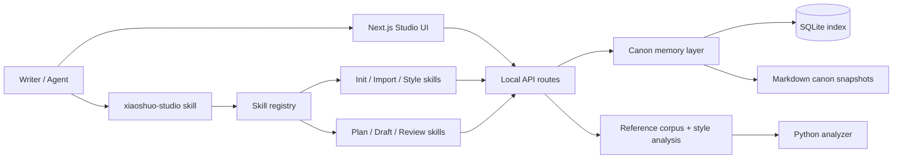
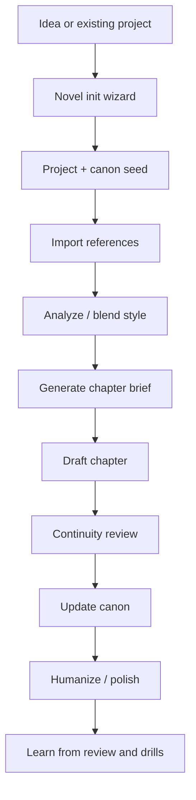

# xiaoshuo

[](https://github.com/Zhao73/xiaoshuo-studio/actions/workflows/ci.yml)
[](./LICENSE)

Local fiction studio for long-form novel planning, canon memory, style learning, and skill-based writing workflows for Codex and Claude Code.

面向长篇小说创作的本地工作台：建书向导、剧情记忆、参考小说技法学习、章节规划、连续性检查、skill 聚合入口，都放在同一个项目里。

## Screenshots

### Home


### Novel Init Wizard


## English Overview

`xiaoshuo` is built for writers who want one local-first workspace that can:

- plan a novel from scratch through a guided interview wizard
- maintain canon memory across long serial writing
- import private reference novels for technique transfer
- route Codex or Claude Code through one top-level skill instead of many scattered skill names
- export or install a reusable skill bundle for open-source distribution

## 中文概览

`xiaoshuo` 适合这种写作方式：

- 从一个想法开始，用问答式向导把书搭起来
- 写长篇时不靠模型“自己记住”，而是靠 canon 和记忆层稳住连续性
- 把你本地收藏的小说样本导入进来，学习节奏、对白、钩子和推进方式
- 用一个总入口 skill `xiaoshuo-studio` 驱动整个项目，而不是记住一堆零散 skill 名
- 开源后直接导出或安装 skill bundle，别人也能一键用起来

## Architecture



## Writing Workflow



## Install Matrix

| Goal | Command |
| --- | --- |
| Run locally | `npm install && npm run dev` |
| Verify locally | `npm run lint && npm test && npm run build && pytest tests/python -q` |
| Export one remembered entry skill for Codex | `npm run skills:export -- --target codex --mode aggregator-only` |
| Export full skill bundle for Codex | `npm run skills:export -- --target codex --mode full-bundle` |
| Export full skill bundle for Claude Code | `npm run skills:export -- --target claude --mode full-bundle` |
| Install one remembered entry skill for Codex | `npm run skills:install -- --target codex --mode aggregator-only` |
| Install full bundle for Codex | `npm run skills:install -- --target codex --mode full-bundle` |
| Install full bundle for Claude Code | `npm run skills:install -- --target claude --mode full-bundle` |

Defaults:

- Codex installs to `~/.codex/skills` unless `CODEX_HOME` is set
- Claude installs to `~/.claude/skills` unless `CLAUDE_HOME` is set

## Quick Start

```bash
npm install
npm run dev
```

Open `http://localhost:3000` or the local port shown by Next.js.

Recommended first steps:

1. Open `/wizard/new-novel`
2. Answer the deep planning interview
3. Confirm the generated project, canon seed, volume outline, and chapter-one brief
4. Import reference novels if needed
5. Continue drafting through the canon-aware workflow

## Top-level Skill

If you only want to remember one skill name, use:

```text
xiaoshuo-studio
```

It routes requests such as:

- “帮我一步步创建一本修仙小说”
- “导入这个本地小说文件夹并分析风格”
- “继续写第 12 章”
- “检查连续性然后回写 canon”

For deeper control, the repo still ships child skills such as:

- `novel-init-wizard`
- `novel-load-context`
- `novel-plan-next`
- `novel-draft-scene`
- `novel-continuity-review`
- `novel-update-canon`
- `webnovel-import-folder`
- `webnovel-analyze-style`
- `webnovel-write`

## Canon API

Primary local routes for long-form memory:

- `GET /api/canon?projectId=<id>`
- `POST /api/canon/refresh`
- `POST /api/chapters/brief`
- `POST /api/chapters/continuity-check`
- `POST /api/chapters/update-canon`

Wizard routes:

- `POST /api/wizard/start`
- `POST /api/wizard/answer`
- `GET /api/wizard/session?sessionId=<id>`
- `POST /api/wizard/finish`

## Style-learning Guardrail

This project is built for **technique transfer**, not author cloning.

The intended loop is:

1. import or capture references with provenance
2. analyze them into reusable metrics
3. convert metrics into style cards and anti-AI focus items
4. write or revise using blended technique constraints
5. turn review output into drills

## Repository Quality

This repository now includes:

- CI on push and pull request
- lint, test, build, and Python verification gates
- issue templates
- pull request template
- `CODEOWNERS`
- `CONTRIBUTING.md`
- `SECURITY.md`
- MIT license

## Docs

- Detailed local workflow: [docs/local-codex-studio.md](./docs/local-codex-studio.md)
- Skill map: [docs/skills-map.md](./docs/skills-map.md)
- Chinese tutorial: [docs/tutorial-zh.md](./docs/tutorial-zh.md)
- Style analyzer contract: [docs/style-analysis-contract.md](./docs/style-analysis-contract.md)

## Codex Requirement

This studio assumes a locally installed and locally logged-in Codex CLI:

```bash
codex --version
```

The web app checks local Codex availability. It does not replace Codex login with a custom OpenAI API flow.
